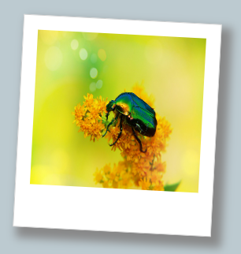

You can add new CSS classes whenever you want to create a new style. Make sure you give the style a sensible name. 

Try to make sure your style is reusable and just contains properties that you want to use together. 

This `photo` class creates a printed photo style that can be applied to an image.

--- code ---
---
language: CSS
filename: style.css
line_numbers: false
---

/* Printed photo style */

.photo {
  border: 1px solid #D0D0D0; /* Add a solid border */
  width: 14rem;
  height: 15rem;
  background: #ffffff;
  padding-top: 1rem;
  padding-left: 1rem;
  padding-right: 1rem;
  padding-bottom: 3rem;
  box-shadow: 8px 8px 10px 4px #888888; /* right and bottom shadow, blur, spread, and colour */
  transform: rotate(3deg);
}

--- /code ---

--- code ---
---
language: HTML
filename: index.html
line_numbers: false
---

<section>
  
</section>

--- /code ---

