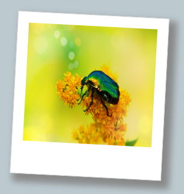

Je kunt nieuwe CSS classes toevoegen wanneer je een nieuwe stijl wilt maken. Zorg ervoor dat je de stijl een logische naam geeft.

Zorg ervoor dat je stijl herbruikbaar is en alleen eigenschappen bevat die je samen wilt gebruiken.

Deze `photo` class maakt een afgedrukte fotostijl die kan worden toegepast op een afbeelding.

--- code ---
---
language: CSS
filename: style.css
line_numbers: false
---

/* Afgedrukte fotostijl */

.photo {
  border: 1px solid #D0D0D0; /* Voeg een effen rand toe */
  width: 14rem;
  height: 15rem;
  background: #ffffff;
  padding-top: 1rem;
  padding-left: 1rem;
  padding-right: 1rem;
  padding-bottom: 3rem;
  box-shadow: 8px 8px 10px 4px #888888; /* schaduw rechts en onderaan, vervaging, spreiding en kleur */
  transform: rotate(3deg);
}

--- /code ---

--- code ---
---
language: HTML
filename: index.html
line_numbers: false
---

<section>
  
</section>

--- /code ---

